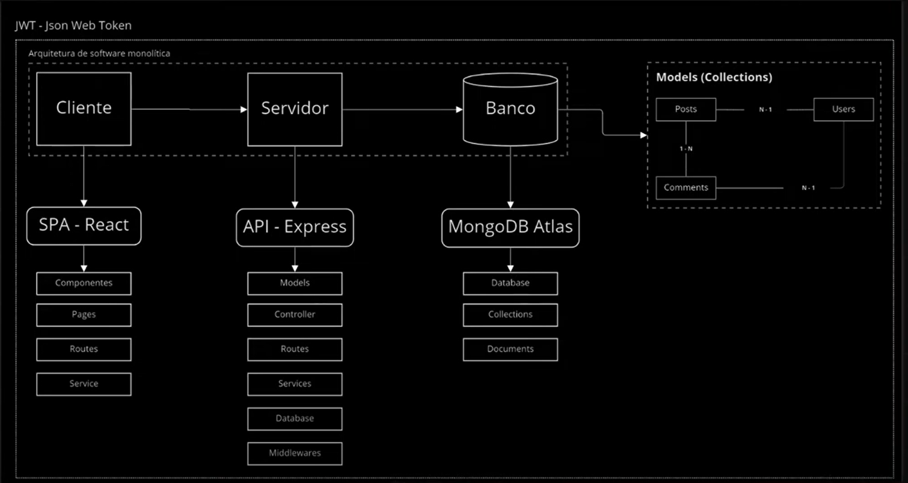

# API REST

Repositório de estudos para o desenvolvimento de uma **API RESTful** utilizando:

* Node.js
* TypeScript
* Express.js Framework
* Supabase PostrgreSQL Database

``Aplicação organizada com arquitetura em camadas, visando separação de responsabilidades e escalabilidade.``

 